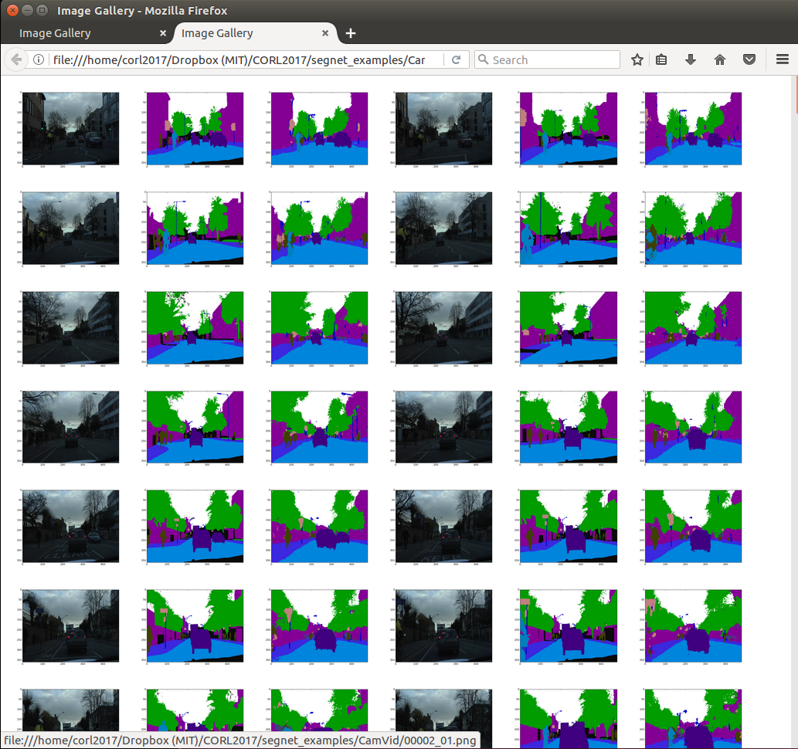

# simple_img_gallery
The simplest way to make a static image library, with only a little Python, minimal HTML, and nothing else

<p align="center">
  
</p>

## Install

None, no dependencies other than Python and Firefox

## Instructions

	python generate_gallery.py ./sample_images

Alternatively, instead of `sample_images`, pass a full path to a directory of images of your choice:

	python generate_gallery.py /path/to/image_directory

The script will create an `index.html` in that directory, and view it with Firefox.

## Features

- Tile `N` images per row: pass an argument after the directory path.  (The default is `3`.)  For example, to tile `6` per row:
	
```
	python generate_gallery.py /path/to/image_directory 6
```
<p align="center">
  
</p>

- Click on any image to zoom (thank you browser)

- Right click on any image and "Save Image As" (if you want it for your plots)

Note:

- Currently only supports tiling the images in alphabetical order.

Future features:

- Support randomization, down-sampling
